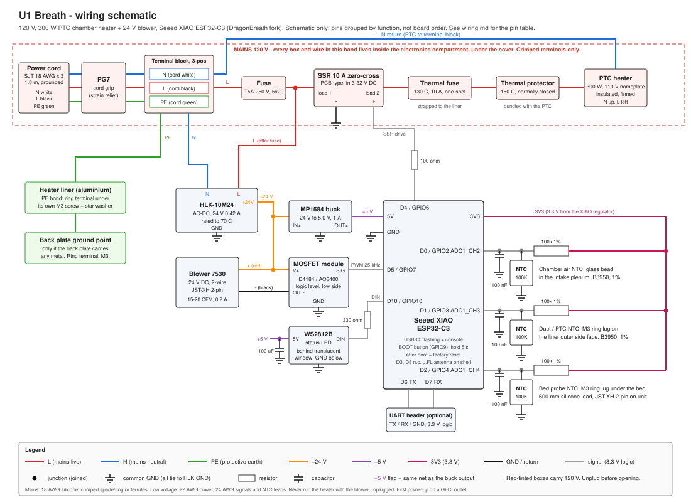

# Wiring

Electrical design for U1 Breath: a 120 V, 300 W PTC chamber heater and HEPA/carbon filter for
the Snapmaker U1, controlled by a Seeed XIAO ESP32-C3 running the DragonBreath firmware fork.
Part numbers and ratings are in [`bom.md`](bom.md). The schematic below is the reference drawing;
this page is the text version of the same circuit.



`wiring.svg` is a hand-drawn schematic, not a board layout. Boxes are parts, lines are wires, and
the colours follow the conventions in [Wire gauge and colours](#wire-gauge-and-colours).
The XIAO is drawn as a symbol with its pins grouped by function; the physical pin order is in the
table below.

## Read this first: mains safety rules

The heater side of this unit is 120 V mains. It will hurt or kill you if you are careless.

1. Every mains conductor (cord, terminal block, fuse, SSR load side, thermal fuse, thermal
   protector, PTC leads, HLK-10M24 input) stays inside the electronics compartment, under the
   cover. Nothing at mains potential is reachable with the cover on.
2. Crimp, never twist. Every mains joint is a crimped spade or ring terminal, or a ferrule in
   the lever terminal block. No twisted-and-taped joints, no solder-only joints on mains.
3. PE (protective earth, the green cord conductor) is bonded to the aluminium heater liner
   with a ring terminal under its own M3 screw, and to the back plate ground point if the back
   plate carries any metal. Test for continuity (under 0.1 ohm) from the cord plug's earth pin
   to the liner before the first power-up.
4. The 5 A slow-blow fuse comes first. It is the first thing after the terminal block on L;
   everything downstream (SSR, heater, HLK-10M24) is behind it.
5. The 130 C thermal fuse and the PTC's bundled 150 C thermal protector are in series with
   the element. They are the hardware backstop if the firmware, SSR, or blower fails. Never
   bypass them, and replace a blown thermal fuse with the same rating.
6. Never run the heater with the blower unplugged. A 300 W PTC with no airflow will trip the
   protector, then the thermal fuse, and can damage the shell. The firmware always runs the
   blower while heating and the duct sensor folds the heater back if the liner overheats, but
   there is no tachometer: a stalled blower is caught thermally, not electrically.
7. Test with a GFCI outlet on the first power-up, and ideally keep using one.
8. Unplug before opening. The SSR leaks a little current even when off, and the HLK-10M24
   input capacitor holds a charge for a few seconds after unplugging. Pull the plug, count to
   ten, then open the cover.

## Connector and pin table

Seeed XIAO ESP32-C3, viewed from the top with the USB-C connector up. Left column D0 to D6 top
to bottom, right column 5V, GND, 3V3, D10, D9, D8, D7 top to bottom.

| XIAO pin | GPIO | Function | Goes to |
|---|---|---|---|
| D0 | GPIO2 (ADC1_CH2) | Chamber air temperature, ADC | Divider node: 100 kOhm to 3V3, chamber NTC (glass bead, intake plenum) to GND, 100 nF to GND |
| D1 | GPIO3 (ADC1_CH3) | Duct / PTC temperature, ADC | Divider node: 100 kOhm to 3V3, duct NTC (M3 ring lug on the liner's outer side face) to GND, 100 nF to GND |
| D2 | GPIO4 (ADC1_CH4) | Bed probe temperature, ADC | Divider node: 100 kOhm to 3V3, bed NTC (M3 ring lug under the bed, 600 mm lead, JST-XH 2-pin) to GND, 100 nF to GND |
| D3 | GPIO5 | Unused | Not connected |
| D4 | GPIO6 | Heater SSR drive, digital out | 100 ohm series resistor, then SSR control + ; SSR control - to GND |
| D5 | GPIO7 | Blower PWM, 25 kHz | MOSFET module SIG |
| D6 | GPIO21 | Console UART TX | Optional 3-pin header (TX, RX, GND) |
| D7 | GPIO20 | Console UART RX | Optional 3-pin header (TX, RX, GND) |
| D8 | GPIO8 | Unused | Not connected (strapping pin, leave free) |
| D9 | GPIO9 | BOOT button (on board) | Nothing external. Tap = arm AUTO / master OFF, hold 2 s = panic-off, hold 10 s = factory reset |
| D10 | GPIO10 | Status LED data | 330 ohm series resistor, then WS2812B DIN |
| 5V | - | Board supply in | MP1584 buck output, set to 5.0 V |
| 3V3 | - | 3.3 V out (board regulator) | Top of the three NTC dividers |
| GND | - | Common ground | HLK-10M24 GND, buck GND, MOSFET GND, SSR control -, LED GND, NTC and capacitor returns |
| USB-C | - | Flashing and serial | Host computer only; not used in the installed unit |

Other connectors on the unit:

| Connector | Pins | Purpose |
|---|---|---|
| IEC-style bare cord through PG7 cord grip | L (black), N (white), PE (green) | Mains in |
| JST-XH 2-pin, blower | + (red), - (black) | 24 V blower, polarised |
| JST-XH 2-pin, bed probe | NTC, NTC (no polarity) | 600 mm silicone lead to the bed ring lug |
| 3-pin 2.54 mm header (optional) | TX, RX, GND | Console UART, 3.3 V logic |

## Mains path (120 V)

In order, from the wall to the heater. Everything on this list lives in the electronics
compartment and is 18 AWG silicone wire with crimped spade or ring terminals (ferrules in the
terminal block).

1. 3-conductor 18 AWG SJT cord enters through the PG7 cord grip in the compartment wall.
2. Cord conductors land in the 3-position lever terminal block (Wago 221-413 or equivalent):
   L (black), N (white), PE (green). This block is the only place the cord terminates.
3. PE (green) leaves the block as 18 AWG green wire with a ring terminal under a dedicated
   M3 screw and star washer on the aluminium heater liner. This bonds the liner. If the back
   plate carries any metal, a second green wire runs from the same block position to a ring
   terminal on the back plate ground point. PE does nothing else and is never switched or fused.
4. L leaves the block to the 5 x 20 mm fuse holder with a T5A 250 V slow-blow fuse.
5. Fuse output goes to the SSR load terminal 1 (10 A zero-cross PCB SSR, 3 to 32 V DC input).
   The same fused-L node also feeds the HLK-10M24 L input (step 10).
6. SSR load terminal 2 goes to the 130 C thermal fuse (Microtemp G4A01130 class), which is
   strapped to the liner so it reads liner temperature.
7. Thermal fuse output goes to the PTC element's bundled normally-closed 150 C thermal
   protector.
8. The protector feeds the PTC element itself (110 V nameplate, 300 W, insulated).
9. The PTC's other lead returns to N at the terminal block.
10. The HLK-10M24 AC-DC module (24 V, 0.42 A) takes L from the fused node (after the fuse,
    before the SSR) and N from the terminal block. It is always on when the cord is plugged in,
    so the controller and blower run whether or not the heater is on.

Heater current is about 2.5 A at 120 V with a short inrush of roughly 2x. The 5 A slow-blow fuse
protects the wiring, not the element; the thermal fuse and protector protect the element and
the shell.

## Low-voltage path (24 V and 5 V)

- HLK-10M24 +24 V out feeds the blower + (red) and the MP1584 mini buck IN+.
- The buck is set to 5.0 V before it is connected. Buck OUT+ goes to the XIAO 5V pin.
- All grounds are common: HLK-10M24 GND, buck IN-/OUT-, XIAO GND, MOSFET module GND,
  SSR control -, LED GND, and every sensor return.
- Blower - (black) goes to the MOSFET module OUT-. The module's V+ is tied to 24 V if the
  module needs it (the D4184 module does; a bare AO3400 breakout does not). The module's
  SIG input comes from XIAO D5 (GPIO7), driven with 25 kHz PWM. Low-side switching, so the
  blower's + lead is always at 24 V and only the return is chopped.
- SSR control: XIAO D4 (GPIO6) through a 100 ohm series resistor to SSR control +. SSR control
  - to GND. The SSR input is rated 3 to 32 V DC, so the 3.3 V GPIO drives it directly; the
  resistor limits the gate current and protects the GPIO if the SSR input ever shorts.
- WS2812B status LED: 5 V and GND from the 5 V rail with a 100 uF electrolytic across the LED
  supply pins, DIN from XIAO D10 (GPIO10) through a 330 ohm series resistor, mounted close to
  the LED.
- UART console (optional): D6 (GPIO21) is TX and D7 (GPIO20) is RX on a 3-pin header. The
  XIAO's own USB-C port is used for flashing and gives the same console, so the header is
  only there if you want a logic-analyser or serial-adapter hookup with the cover on.
- BOOT button (GPIO9): tap = arm AUTO or master OFF, hold 2 s = panic-off, hold 10 s = factory reset (erases WiFi and settings).
- Unused: D3 (GPIO5) and D8 (GPIO8). Leave them unconnected; GPIO8 is a strapping pin.

## Sensor dividers

Three identical dividers, one per NTC. Each NTC is 100K at 25 C, Beta 3950, 1 percent. The
fixed resistor is 100 kOhm 1 percent, so the divider is centred on 25 C and reads well across
the 20 to 80 C range the firmware cares about.

Each divider: 3V3 to the 100 kOhm fixed resistor, the far end of the resistor is the ADC node
that goes to the XIAO pin, the NTC goes from that node to GND, and a 100 nF ceramic capacitor
sits from the node to GND to filter blower and SSR noise. The capacitor and resistor go on the
small perfboard next to the XIAO, not out at the sensor.

```
 3V3 ----[ 100k 1% ]----+---- ADC pin (D0 / D1 / D2)
                         |
                      [ NTC ]   100K, B3950
                         |
                         +---- 100 nF ---- GND
                         |
                        GND
```

| Sensor | NTC type | Location | ADC pin |
|---|---|---|---|
| Chamber air | Glass bead | In the intake plenum, in the airstream, not touching the liner | D0 (GPIO2, ADC1_CH2) |
| Duct / PTC | M3 ring lug | On the liner's outer side face, under its own M3 screw, Kapton under the lug | D1 (GPIO3, ADC1_CH3) |
| Bed probe | M3 ring lug | Under the printer bed, 600 mm 2-conductor silicone lead to the JST-XH 2-pin on the unit | D2 (GPIO4, ADC1_CH4) |

The ring-lug NTCs are electrically isolated from their lugs, but still put Kapton between the
lug and the liner so the sensor lead cannot pick up PE as a return path.

## Wire gauge and colours

| Circuit | Gauge | Colour | Termination |
|---|---|---|---|
| Mains L | 18 AWG silicone, 200 C | Red (black in the cord) | Insulated crimp spade/ring, ferrule in the block |
| Mains N | 18 AWG silicone | Blue (white in the cord) | Insulated crimp spade/ring, ferrule in the block |
| PE | 18 AWG silicone | Green or green/yellow | Ring terminal, M3 screw and star washer |
| PTC and thermal fuse leads | 18 AWG silicone, glass-fibre sleeve | As supplied (bundle in glass sleeve) | Crimp, heat-shrink over the crimp |
| 24 V | 22 AWG silicone | Orange (+), black (-) | Soldered to modules, JST-XH to the blower |
| 5 V | 22 AWG silicone | Purple (+), black (-) | Soldered |
| 3.3 V sensor supply | 24 AWG silicone | Pink or white | Soldered on the perfboard |
| Signals (SSR drive, PWM, LED DIN, UART) | 24 AWG silicone | Grey, yellow for PWM if you want to tell them apart | Soldered, header |
| NTC leads | 24 AWG silicone, 2-conductor for the bed probe | White/white | Soldered on the perfboard, JST-XH for the bed probe |

The same colours are used in `wiring.svg`: red L, blue N, green PE, orange 24 V, purple 5 V,
pink 3.3 V, black GND, grey signals.

Keep the mains bundle and the low-voltage bundle on opposite sides of the compartment; the
SSR control leads cross to the SSR, nothing else does. Heat-shrink every crimp on the PTC and
thermal fuse leads, and sleeve the PTC leads in glass fibre where they pass the liner.

## First power-up checklist

1. Cover off, cord unplugged. Continuity from the plug's earth pin to the liner and back plate
   is under 0.1 ohm. No continuity from L or N to PE or to the liner.
2. Buck trimmed to 5.0 V with the XIAO disconnected, then connected.
3. Blower plugged in, SSR control leads connected, heater leads connected.
4. Cover on. Plug into a GFCI outlet. The LED should come up within two seconds.
5. Confirm all three temperatures read room temperature in the console before enabling the
   heater for the first time.
6. First heat run with someone watching: the duct NTC should rise well before the chamber
   NTC, and the blower must be running the whole time.
